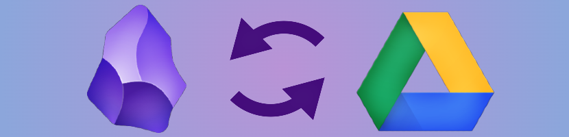

# Obsidian Google Drive Sync

<p align="center">
  
</p>

Sync your Obsidian vault to/from Google Drive. Keep your notes backed up and synchronized across devices.

## Features

- **Two-way sync**: Upload local changes to Google Drive and download remote changes
- **Automatic sync**: Set up automatic synchronization at configurable intervals
- **Conflict resolution**: Multiple strategies for handling conflicts (keep newer, keep local, keep remote, or keep both)
- **Selective sync**: Exclude specific folders or file extensions from synchronization
- **Secure authentication**: Uses OAuth 2.0 for secure Google Drive access
- **Progress tracking**: Status bar and ribbon icon show sync progress
- **Debug mode**: Enable detailed logging for troubleshooting

## Installation

### From Obsidian Community Plugins

1. Open Obsidian Settings
2. Go to Community Plugins
3. Search for "Google Drive Sync"
4. Click Install, then Enable

### Manual Installation

1. Download the latest release from the releases page
2. Extract the files to your vault's `.obsidian/plugins/obsidian-gsync/` folder
3. Reload Obsidian
4. Enable the plugin in Settings > Community Plugins

## Setup

### Creating Google OAuth Credentials

This plugin requires you to create your own Google OAuth credentials:

1. Go to the [Google Cloud Console](https://console.cloud.google.com/)
2. Create a new project or select an existing one
3. Enable the **Google Drive API** for your project:
   - Go to "APIs & Services" > "Library"
   - Search for "Google Drive API"
   - Click "Enable"
4. Create OAuth credentials:
   - Go to "APIs & Services" > "Credentials"
   - Click "Create Credentials" > "OAuth client ID"
   - If prompted, configure the OAuth consent screen first (External or Internal)
   - Select "Desktop app" as the application type
   - Give it a name (e.g., "Obsidian GSync")
5. Add the redirect URI:
   - After creating, click on your OAuth client
   - Under "Authorized redirect URIs", add: `http://localhost:42813/callback`
6. Copy your **Client ID** and **Client Secret**

### Configuring the Plugin

1. Open Obsidian Settings > Google Drive Sync
2. Enter your Client ID and Client Secret
3. Click "Connect to Google Drive"
4. Complete the Google sign-in process in your browser
5. Return to Obsidian - you should see "Connected to Google Drive"

## Usage

### Manual Sync

- Click the cloud icon in the ribbon to trigger a sync
- Or use the command palette: "Google Drive Sync: Sync Now"

### Automatic Sync

1. Enable "Auto Sync" in settings
2. Set the sync interval (5-120 minutes)
3. The plugin will automatically sync in the background

### Commands

- **Sync Now**: Trigger an immediate sync
- **Force Upload All**: Reset sync state and upload all files
- **Open Settings**: Open the plugin settings

## Settings

| Setting | Description |
|---------|-------------|
| Sync Folder Name | Name of the folder in Google Drive (default: "ObsidianVault") |
| Auto Sync | Enable automatic periodic syncing |
| Auto Sync Interval | How often to sync (5-120 minutes) |
| Sync on Startup | Sync when Obsidian starts |
| Conflict Resolution | How to handle conflicts (newer/local/remote/both) |
| Excluded Folders | Folders to skip during sync |
| Excluded Extensions | File types to skip during sync |
| Include Hidden Files | Whether to sync dotfiles |
| Debug Mode | Enable verbose logging |

## Conflict Resolution Strategies

- **Keep newer**: Automatically keeps the more recently modified version
- **Keep local**: Always prefer local changes
- **Keep remote**: Always prefer remote changes
- **Keep both**: Rename local file and download remote version

## Excluded by Default

The following folders are excluded from sync by default:

- `.obsidian` - Obsidian configuration (sync separately if needed)
- `.git` - Git version control
- `.trash` - Obsidian trash

## Troubleshooting

### "Not authenticated" error

- Ensure you've completed the Google sign-in process
- Try disconnecting and reconnecting in settings
- Check that your OAuth credentials are correct

### Sync not working

1. Enable Debug Mode in settings
2. Open the Developer Console (Ctrl/Cmd + Shift + I)
3. Look for error messages starting with "GSync:"

### Port 42813 in use

The plugin uses port 42813 for OAuth callback. If this port is in use:

1. Close any applications using this port
2. Restart Obsidian
3. Try connecting again

## Privacy & Security

- Your OAuth credentials are stored locally in Obsidian's plugin data
- Access tokens are refreshed automatically and stored locally
- The plugin only accesses files in its designated sync folder
- No data is sent to third parties (only to Google Drive)

## Development

```bash
# Clone the repository
git clone https://github.com/ricardorodrigues-ca/obsidian-gsync.git

# Install dependencies
npm install

# Build for development (watch mode)
npm run dev

# Build for production
npm run build
```

## License

MIT License - see [LICENSE](LICENSE) for details.

## Support

- [Report issues](https://github.com/ricardorodrigues-ca/obsidian-gsync/issues)
- [Feature requests](https://github.com/ricardorodrigues-ca/obsidian-gsync/issues)
